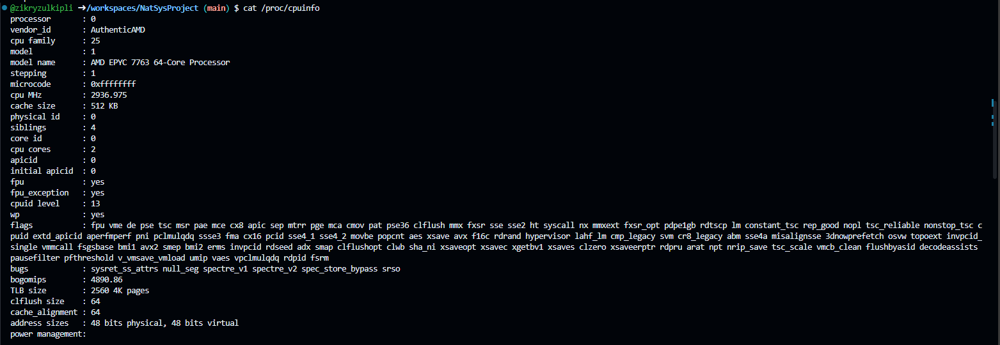
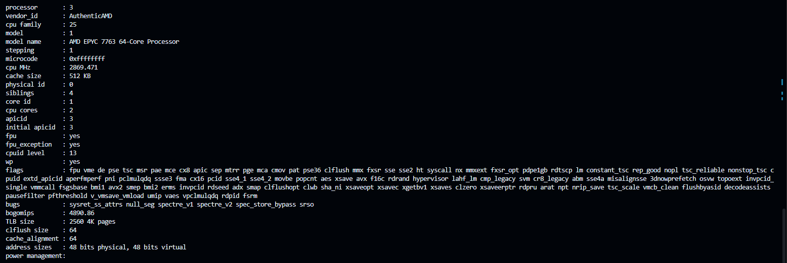
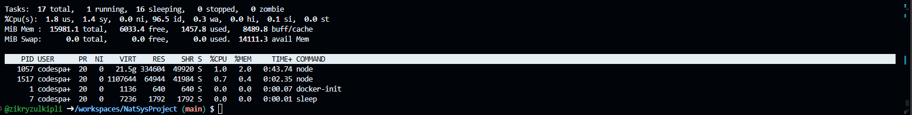

# Net&Sys Assignment: Running Containers for Application Development

Group Name: __EasyOS__. 

Team Mates:
1. __Muhammad Zikry bin Zulkipli (2219579)__
2. __Mohamad Wafiq Bin Mohd Zainuddin (2215099)__
3. __Iryan Syauqi Bin Azhar (2213601)__

## Rules
1. You are allowed to have **3 group** members.
2. When you complete the assignment, make sure to submit the repository link of your cloned project. Make sure all the files are as what you aspect in your repository. 
3. Answer all questions in the **README.md**, in your own repository. Either use the online VSCode, terminal or github to edit. Answers are expected where you see __Fill answer here__.
4. Learn how to use markdown. https://www.w3schools.io/file/markdown-introduction/

## Forking this project repository
1. First thing you need in doing this assignment is to have a github account. Make sure to sign up at https://www.github.com
2. The second thing you need is to fork the Net&Sys Assignment repository in your own github account. 

    1. Go to https://github.com/ZainabBashi/NatSysProject and click fork to copy the project into your own repository
    2. Make sure that the new fork is now in your own repository

***Questions:***

1. What is the link of the fork Net&Sys Assignment in your repository. ***(1 mark)*** 
    - __https://github.com/zikryzulkipli/NatSysProject.git__.
2. How many files and folders are in this repository. ***(1 mark)*** 
    - __2. images, and README.md__.


## Exploring github codespaces

1. The next thing that we will be doing is exploring codespaces. First of all, read about codespaces https://docs.github.com/en/codespaces/overview#what-is-a-codespace
2. Then go to the link https://github.com/codespaces and we shall start a new codespace.  
3. Click on ***New codespace***.
4. Choose your own Net&Sys Assignment repository to start your codespace.

 

5. Once you have created you codespace, you will see the following. You might already be familiar with this, since it will look similar to VSCode. 

 

6. You will see the [README file](./README.md) file. One is a preview of how it looks like on the web, and the other is the editing view in markdown language. 
7. Edit the [README file](./README.md). Make sure you have your group details correct, ie, group name and team members along with their matric Numbers. 
8. Once you have finish editing, click File->Save or ***ctrl-s*** to save it. 
9. After saving, you will notice an M or U next to your file. You will need to commit any changes, whenever you make changes so that it is uploaded to the github repository. 

 

10. Click on the source control, hint: its on the left side panel, and it will list down the files that have been modified or updated. Click on commit. It will then ask you "Would you like to stage all your changes and commit them directly?" Just say yes, and a new tab will appear. Type a message to log what you have done, and click on the check mark. 

 

11. After that, sync the changes to the main repository. 
12. Make sure to commit and sync your files to the main repository, or else, your work will be lost since it is not saved into the main repository when you submit your project.

***Questions:***

1. What is default OS used to run the virtual environment for codespaces. ***(1 mark)*** 
    - __Glorious Zebra__.
2. What are the two options of RAM, disk and vcpu configuration you can have in running codespaces . ***(1 mark)*** 
    1. __2-core with 8GB RAM, and 32GB storage__.
    2. __4-core with 16GB RAM, and 32GB storage__.
3. Why must we commit and sync our current work on source control? ***(1 mark)*** 
    - __Committing our work is to publish our work to the team while syncing is to ensure we get the latest commit by the team__.

## Exploring the Terminal

1. Look at the TERMINAL tab. Explore and run commands according to the questions below. 
2. You can include your answers as images, or cut and paste the output here. If you are cutting and pasting your answers, wrap your answers in the codeblock clause in markdown. For example, if i run the command **whoami** the the output would look like the one below.
```bash
@joeynor ➜ /workspaces/OSProject (main) $ whoami 
codespace
```


***Questions:***

Look at the TERMINAL tab. Run the following commands and provide the output here. 

1. Run the command **pwd** . ***(1 mark)*** 
```bash
/workspaces/NatSysProject
```
2. Run the command **cat /etc/passwd** . ***(1 mark)***
```bash
root:x:0:0:root:/root:/bin/bash
daemon:x:1:1:daemon:/usr/sbin:/usr/sbin/nologin
bin:x:2:2:bin:/bin:/usr/sbin/nologin
sys:x:3:3:sys:/dev:/usr/sbin/nologin
sync:x:4:65534:sync:/bin:/bin/sync
games:x:5:60:games:/usr/games:/usr/sbin/nologin
man:x:6:12:man:/var/cache/man:/usr/sbin/nologin
lp:x:7:7:lp:/var/spool/lpd:/usr/sbin/nologin
mail:x:8:8:mail:/var/mail:/usr/sbin/nologin
news:x:9:9:news:/var/spool/news:/usr/sbin/nologin
uucp:x:10:10:uucp:/var/spool/uucp:/usr/sbin/nologin
proxy:x:13:13:proxy:/bin:/usr/sbin/nologin
www-data:x:33:33:www-data:/var/www:/usr/sbin/nologin
backup:x:34:34:backup:/var/backups:/usr/sbin/nologin
list:x:38:38:Mailing List Manager:/var/list:/usr/sbin/nologin
irc:x:39:39:ircd:/var/run/ircd:/usr/sbin/nologin
gnats:x:41:41:Gnats Bug-Reporting System (admin):/var/lib/gnats:/usr/sbin/nologin
nobody:x:65534:65534:nobody:/nonexistent:/usr/sbin/nologin
apt:x:100:65534::/nonexistent:/usr/sbin/nologin
systemd-timesync:x:101:101:systemd Time Synchronization,,,:/run/systemd:/usr/sbin/nologin
systemd-network:x:102:103:systemd Network Management,,,:/run/systemd:/usr/sbin/nologin
systemd-resolve:x:103:104:systemd Resolver,,,:/run/systemd:/usr/sbin/nologin
messagebus:x:104:105::/nonexistent:/usr/sbin/nologin
codespace:x:1000:1000::/home/codespace:/bin/bash
sshd:x:105:65534::/run/sshd:/usr/sbin/nologin
```
3. Run the command **df** . ***(1 mark)*** 
```bash
Filesystem     1K-blocks     Used Available Use% Mounted on
overlay         32847680 10382352  20771228  34% /
tmpfs              65536        0     65536   0% /dev
shm                65536        0     65536   0% /dev/shm
/dev/root       30298176 24343028   5938764  81% /vscode
/dev/sda1      123266624      124 116958764   1% /tmp
/dev/loop3      32847680 10382352  20771228  34% /workspaces
```
4. Run the command **du** . ***(1 mark)*** 
```bash
4       ./myroot/.local/share/nano
8       ./myroot/.local/share
12      ./myroot/.local
24      ./myroot
8       ./webpage
4       ./.git/branches
16      ./.git/objects/1b
12      ./.git/objects/83
8       ./.git/objects/47
8       ./.git/objects/71
12      ./.git/objects/62
8       ./.git/objects/58
36      ./.git/objects/73
12      ./.git/objects/6f
8       ./.git/objects/ce
12      ./.git/objects/40
8       ./.git/objects/a6
12      ./.git/objects/04
8       ./.git/objects/fd
8       ./.git/objects/46
8       ./.git/objects/1a
8       ./.git/objects/59
60      ./.git/objects/e5
8       ./.git/objects/41
8       ./.git/objects/7b
12      ./.git/objects/09
8       ./.git/objects/24
8       ./.git/objects/c6
12      ./.git/objects/3d
8       ./.git/objects/0b
12      ./.git/objects/72
12      ./.git/objects/d2
12      ./.git/objects/a1
8       ./.git/objects/a8
8       ./.git/objects/79
12      ./.git/objects/15
8       ./.git/objects/86
8       ./.git/objects/5b
12      ./.git/objects/1c
20      ./.git/objects/7a
8       ./.git/objects/55
12      ./.git/objects/eb
8       ./.git/objects/bf
8       ./.git/objects/ab
12      ./.git/objects/ff
12      ./.git/objects/af
8       ./.git/objects/74
16      ./.git/objects/8f
8       ./.git/objects/96
8       ./.git/objects/ef
8       ./.git/objects/05
16      ./.git/objects/70
16      ./.git/objects/d8
8       ./.git/objects/1f
8       ./.git/objects/b4
8       ./.git/objects/91
12      ./.git/objects/c3
12      ./.git/objects/48
12      ./.git/objects/da
12      ./.git/objects/3a
12      ./.git/objects/17
8       ./.git/objects/ac
12      ./.git/objects/2e
8       ./.git/objects/0d
8       ./.git/objects/b8
8       ./.git/objects/16
8       ./.git/objects/52
8       ./.git/objects/fc
12      ./.git/objects/6a
8       ./.git/objects/e7
24      ./.git/objects/fb
8       ./.git/objects/fa
8       ./.git/objects/4b
8       ./.git/objects/a5
8       ./.git/objects/f9
12      ./.git/objects/42
12      ./.git/objects/ea
20      ./.git/objects/6e
12      ./.git/objects/b5
8       ./.git/objects/49
8       ./.git/objects/f1
8       ./.git/objects/60
8       ./.git/objects/27
8       ./.git/objects/4c
12      ./.git/objects/85
8       ./.git/objects/fe
8       ./.git/objects/20
8       ./.git/objects/d4
8       ./.git/objects/f6
8       ./.git/objects/3f
12      ./.git/objects/a3
24      ./.git/objects/cd
8       ./.git/objects/f2
8       ./.git/objects/b2
8       ./.git/objects/93
8       ./.git/objects/c7
8       ./.git/objects/81
12      ./.git/objects/22
8       ./.git/objects/e9
8       ./.git/objects/3e
8       ./.git/objects/cb
12      ./.git/objects/64
48      ./.git/objects/b9
8       ./.git/objects/b6
8       ./.git/objects/4f
8       ./.git/objects/4a
4       ./.git/objects/info
8       ./.git/objects/8a
12      ./.git/objects/14
8       ./.git/objects/c9
1824    ./.git/objects/pack
12      ./.git/objects/44
2996    ./.git/objects
8       ./.git/logs/refs/heads
12      ./.git/logs/refs/remotes/origin
16      ./.git/logs/refs/remotes
28      ./.git/logs/refs
36      ./.git/logs
68      ./.git/hooks
4       ./.git/lfs/tmp
8       ./.git/lfs
4       ./.git/refs/tags
8       ./.git/refs/heads
12      ./.git/refs/remotes/origin
16      ./.git/refs/remotes
32      ./.git/refs
8       ./.git/info
3188    ./.git
2096    ./images
5340    .
```
5. Run the command **ls** . ***(1 mark)*** 
```bash
README.md  images
```
6. Run the command **ls -asl** . ***(1 mark)*** 
    
7. Run the command **free -h** . ***(1 mark)*** 
    
8. Run the command **cat /proc/cpuinfo** . ***(1 mark)*** 
    
    
9. Run the command **top** and type **q** to quit. ***(1 mark)*** 
    
10. Run the command **uname -a**. ***(1 mark)*** 
    - __Linux codespaces-e5db00 6.5.0-1021-azure #22~22.04.1-Ubuntu SMP Tue Apr 30 16:08:18 UTC 2024 x86_64 x86_64 x86_64 GNU/Linux__.
11. What is the available free memory in the system. ***(1 mark)*** 
    - __6033.4MB__.
12. What is the available disk space mounted on /workspace. ***(1 mark)*** 
    - __14111.3MB__.
13. Name the version and hardware architecture of the linux Virtual environment. ***(1 mark)*** 
    - __Ubuntu SMP 22.04.1__.
14. What is the difference between **ls** vs **ls -asl**. ***(1 mark)*** 
    - __ls: show directories/folders in the project.__
    - __ls -asl: show access for owners, private, and public to the directories__.
15. What is the TLB size of the Virtual CPU. ***(1 mark)*** 
    - __16 entries__.
16. What is the CPU speed of the Virtual CPU. ***(1 mark)*** 
``` bash 
CPU MHz:                            2595.122
```
17. What is the top running process that consumes the most CPU cycles. ***(1 mark)*** 
```bash
1057 codespa+  20   0   21.5g 334604  49920 S   1.0   2.0   0:43.74 node
```

## Running your own container instance.

1. At the terminal, run a linux instance. By typing the following command. 
```
docker pull debian
docker run --detach -it debian
```
2. This will run the debian container. To check if the debian container is running, type
```bash
@joeynor ➜ /workspaces/OSProject (main) $ docker ps -a
CONTAINER ID   IMAGE     COMMAND   CREATED         STATUS         PORTS     NAMES
f65be1987f84   debian    "bash"    4 minutes ago   Up 4 minutes             romantic_jackson
```

3. Keep note of the name used by your container, this is usually given random names unless you specify your own name. Now run a bash command on the container. Make sure you use the name of your container instead of the one shown here. 
```bash
docker exec -i -t romantic_jackson /bin/bash
```

4. Create a file on the container. First you must make sure you are in the bash command prompt of the container. The container is new, and does not have any software other than the debian OS. To create a new file, you will need an editor installed. In the bash shell of the container, run the package manager apt-get to install nano text editor. 

```bash
root@f65be1987f84:~# apt-get update      

root@f65be1987f84:~# apt-get install nano

root@f65be1987f84:~# cd /root

root@f65be1987f84:~# nano helloworld.txt
```

5. Edit your helloworld.txt, create your messsage and save by typing ctrl-X. Once saved, explore using the container to see where the file is located. Then exit the shell, by typing **exit**.

6. Stop the container and run **docker ps -a**, and restart the container again. Is your file in the container still available?
```bash 
@joeynor ➜ /workspaces/OSProject (main) $ docker stop romantic_jackson

@joeynor ➜ /workspaces/OSProject (main) $ docker ps -a
CONTAINER ID   IMAGE     COMMAND   CREATED          STATUS                        PORTS     NAMES
f65be1987f84   debian    "bash"    19 minutes ago   Exited (137) 18 seconds ago             romantic_jackson

@joeynor ➜ /workspaces/OSProject (main) $ docker restart romantic_jackson
```

7. Stop the container and delete the container. What happened to your helloworld.txt?

```bash 
@joeynor ➜ /workspaces/OSProject (main) $ docker stop romantic_jackson

@joeynor ➜ /workspaces/OSProject (main) $ docker ps -a
CONTAINER ID   IMAGE     COMMAND   CREATED          STATUS                        PORTS     NAMES
f65be1987f84   debian    "bash"    19 minutes ago   Exited (137) 18 seconds ago             romantic_jackson

@joeynor ➜ /workspaces/OSProject (main) $ docker rm romantic_jackson
```

***Questions:***

1. Are files in the container persistent. Why not?. ***(1 mark)*** 
    - __Not persistent. The files lost when the container is removed or stopped.__
2. Can we run two, or three instances of debian linux? . ***(1 mark)*** __Yes.__

## Running your own container with persistent storage

1. In the previous experiment, you might have notice that containers are not persistent. To make storage persistent, you will need to mount them. 
At the terminal, create a new directory called **myroot**, and run a instance of debian linux and mount myroot to the container. Find out the exact path of my root, and mount it as the root folder in the debian container. 
2. Create a file in /root on the container, the files should also appear in myroot of your host VM.

```bash 
@joeynor ➜ /workspaces/OSProject (main) $ mkdir myroot
@joeynor ➜ /workspaces/OSProject (main) $ cd myroot/
@joeynor ➜ /workspaces/OSProject/myroot (main) $ pwd
/workspaces/OSProject/myroot

@joeynor ➜ /workspaces/OSProject/myroot (main) $ docker run --detach -it -v /workspaces/OSProject/myroot:/root debian
```

***Questions:***

1. Check the permission of the files created in myroot, what user and group is the files created in docker container on the host virtual machine? . ***(2 mark)***
```bash
-rw-rw-rw- 1 root root 25 Jun 19 13:21 helloworld.txt
```
2. Can you change the permission of the files to user codespace.  You will need this to be able to commit and get points for this question. ***(2 mark)***
```bash
//use sudo and chown
sudo chown -R codespace:codespace myroot

```
*** __Yes you can change.__***
```bash
-rw-rw-rw- 1 codespace codespace 25 Jun 19 13:21 helloworld.txt
```

## You are on your own, create your own static webpage

1. Create a directory called webpage in your host machine
```bash
@iryanazhar ➜ /workspaces/NatSysProject (main) $ mkdir webpage
@iryanazhar ➜ /workspaces/NatSysProject (main) $ cd webpage
```
2.Inside the directory, create a page index.html, with any content you would like
```bash
@iryanazhar ➜ /workspaces/NatSysProject/webpage (main) $ touch index.html
@iryanazhar ➜ /workspaces/NatSysProject/webpage (main) $ nano index.html
```
3. Then, run the apache webserver and mount the webpage directory to it. Hint:


4. If it works, codespace will trigger a port assignment and provide a URL for you to access your webpage like the one below.

 


5. You can also see the Port in the **PORTS** tab, next to the terminal tab.

6. You can then access your website by adding an index.html towards the end of your url link, like the one below. 

 

***Questions:***

1. What is the permission of folder /usr/local/apache/htdocs and what user and group owns the folder? . ***(2 mark)***
Permissions of Folder /usr/local/apache2/htdocs:

Permissions: drwxr-xr-x

User and Group: User: root Group: root.

2. What port is the apache web server running. ***(1 mark)*** 80
3. What port is open for http protocol on the host machine? ***(1 mark)*** 8080

## Create SUB Networks

1. In docker, you can create your own private networks where you can run multiple services, in this part, we will create two networks, one called bluenet and the other is rednet
2. Run the docker create network to create you networks like the ones below
```bash
## STEP 1:
## Create Networks ##
@wapekkkkk ➜ /workspaces/NatSysProject (main) $ docker network create bluenet
e292bf1aa7188b11ed290b4f7b43492639c704092bca91ef0720f7e3a061f031
@wapekkkkk ➜ /workspaces/NatSysProject (main) $ docker network create rednet
ded73fff84dd60ea16d18901429fa314cb0b5f1fc6d83be370c20fe48f43dce7

## STEP 2: (automatically running)
## Create (1) Container in background called "c1" running busybox image ##
@wapekkkkk ➜ /workspaces/NatSysProject (main) $ docker run -itd --net bluenet --name c1 busybox sh
Unable to find image 'busybox:latest' locally
latest: Pulling from library/busybox
ec562eabd705: Pull complete 
Digest: sha256:9ae97d36d26566ff84e8893c64a6dc4fe8ca6d1144bf5b87b2b85a32def253c7
Status: Downloaded newer image for busybox:latest
eb4dd056614739e119f378b92229b2c55d08cded6ddd065b31345aad4d82078d
@wapekkkkk ➜ /workspaces/NatSysProject (main) $ docker run -itd --net rednet --name c2 busybox sh
2e29cae13df237a1c0c386835e537db91730ce8ca98ca807e7c6e086decc976f
```
***Questions:***

1. Describe what is busybox and what is command switch **--name** is for? . ***(2 mark)*** BusyBox: BusyBox is a software suite that provides several Unix utilities in a single executable file. It is often used in embedded systems and Docker containers because it offers a lightweight set of tools that are efficient and functional. --name switch: The --name switch in Docker is used to assign a name to a container. This makes it easier to reference the container by name rather than by its container ID, simplifying management and identification of the container
2. Explore the network using the command ```docker network ls```, show the output of your terminal. ***(1 mark)***


3. Using ```docker inspect c1``` and ```docker inspect c2``` inscpect the two network. What is the gateway of bluenet and rednet.? ***(1 mark)***
   Gateway bluenet :172.18.0.1
   Gateway rednet : 172.19.0.1
5. What is the network address for the running container c1 and c2.
   Ip address c1 :172.18.0.2
   Ip address c2 :172.19.0.2
7. Using the command ```docker exec c1 ping c2```, which basically issue a ping from container c1 to c2. Are you able to ping? Show your output . ***(1 mark)***

No , Since c1 and c2 are on different networks (bluenet and rednet respectively), they cannot communicate directly with each other. Therefore, the ping command fails with a "bad address" error.

## Bridging two SUB Networks
1. Let's try this again by creating a network to bridge the two containers in the two subnetworks
```
@wapekkkkk ➜ /workspaces/NatSysProject (main) $ docker network create bridgenet
f720d32a9f27c2817ebbe5ee6005f48a0426af7bb43a2903ef6f1627e1c71d04
@wapekkkkk ➜ /workspaces/NatSysProject (main) $ docker network connect bridgenet c1
@wapekkkkk ➜ /workspaces/NatSysProject (main) $ docker network connect bridgenet c2
@wapekkkkk ➜ /workspaces/NatSysProject (main) $ docker exec c1 ping c2
```

Yes . I am able to ping c2 from c1 successfully.
Previous Ping: The previous ping attempt failed with the error ping: bad address 'c2' because c1 and c2 were on separate, isolated networks (bluenet and rednet) and couldn't communicate with each other directly.

Current Ping: After connecting both containers to the bridgenet network, they are now part of a common network, allowing them to communicate with each other. As a result, the ping from c1 to c2 is successful.

## What to submit

1. Make sure to commit all changes on your source control, and make sure your source control is sync to the repository. 
2. Check your repository link, to see if all the files and answers are included in the repository. 
3. Submit through italeem, by providing the link to your repository.
4. Due by ***30 May, 2024***
